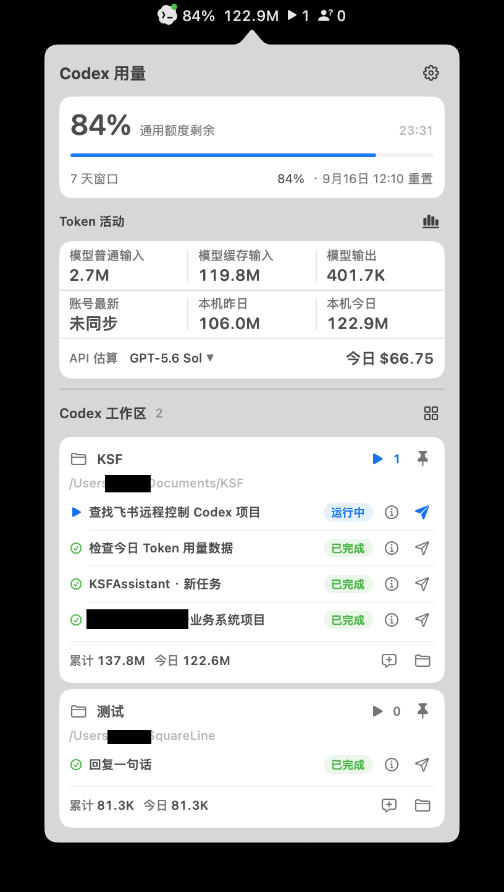
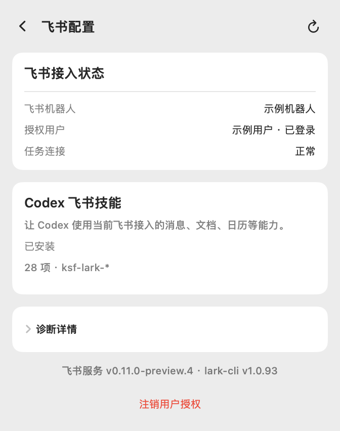
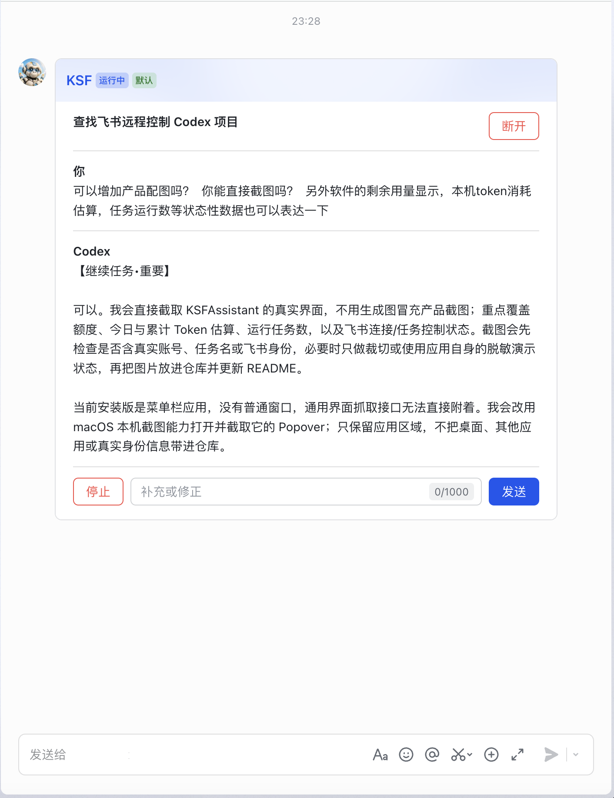
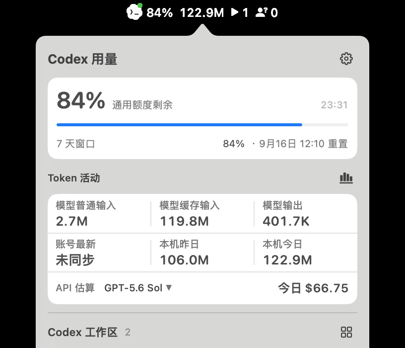

# KSFAssistant

> 把飞书变成 Codex 的远程控制器。
>
> 电脑留在桌上，你在飞书里继续同一个任务。

KSFAssistant 是一款运行在 macOS 菜单栏和 Windows 系统托盘的开源桌面应用。它把本机 Codex 任务连接到飞书：查看进度、回答问题、运行中纠偏、继续下一轮，或者停止当前执行。

它不会在飞书里另起一个失去上下文的 AI 会话，而是接回你已经在 Codex Desktop 里做的那件事。

  

实际运行的 macOS 工作台。

**当前版本：`0.11.0-preview.16` · 首个基础产品预览版 · [MIT License](LICENSE)**

macOS Apple Silicon 已完成实机闭环验收。Intel Mac 和 Windows 的构建目标已通过，实机状态见[平台支持](#平台支持)。

## 快速开始

### 使用前准备

- 已安装并登录 Codex Desktop。
- 拥有飞书账号，并能在飞书官方页面创建或选择应用。租户策略要求时，需要管理员完成应用发布或权限审批。

### 安装

从 GitHub Releases 下载当前版本中已标明适用平台的安装包，并使用同一发布中的 `SHA256SUMS` 核对文件。如果某个平台只提供源码而没有安装包，表示该平台尚未完成当前版本的发布验收。

预览包可能尚未公证。系统显示安全提示时，先核对哈希和下载来源；项目不要求关闭系统安全能力。

需要从源码构建时，请阅读[开发者构建说明](docs/CONTRIBUTING_BUILD.md)。

远程使用时，可在设置中开启“禁止电脑睡眠”，让助手运行期间阻止空闲自动睡眠，屏幕仍可关闭。合盖、手动睡眠和网络故障不在保障范围内，详见[防睡眠设置与验收](docs/prevent-sleep.md)。

### 连接飞书

1. 打开 KSFAssistant，进入“设置 → 飞书”。
2. 点击“扫码连接飞书”，在飞书官方页面创建或选择应用。
3. 正常情况下只扫码一次：应用接入、本人绑定和机器人连接会一次完成。
4. 回到任务列表，点击目标任务右侧的纸飞机按钮。
5. 在飞书本人单聊中操作或回复任务卡片。也可以直接发送一条新消息，创建新的 Codex 任务。

  

飞书连接正常，用户能力权限可以等到实际使用时再授权。

### 为什么卡片正常，用户能力却可能显示“按需授权”

KSFAssistant 把基础连接和用户身份能力分开管理：

| 身份 | 作用 | 授权时机 |
| --- | --- | --- |
| 机器人身份 | 消息、任务卡片、按钮回调和 Codex 远程控制 | 首次扫码接入 |
| 用户身份 | 以当前飞书用户操作文档、日历等用户能力 | 首次使用具体能力时，只申请当次缺少的 scope |

因此，“用户能力授权：按需授权（不影响消息和卡片）”是正常状态。只有首次扫码没有返回本人标识，或某项用户能力确实缺权限时，界面才会显示授权入口。

## 核心能力

### 远程继续同一个 Codex 任务

- 从桌面选择一个明确的 Codex 顶层任务并连接飞书。
- 任务运行中追加约束，优先继续当前轮次，不另起孤立会话。
- 查看运行、等待输入、完成、失败和中断状态。
- 回答普通问题、选择方案，或者确认执行已生成的 Plan。
- 停止当前轮次而不删除任务，稍后继续。

  

任务卡片会随 Codex 的当前轮次持续更新。

| 飞书中的操作 | KSFAssistant 的处理方式 |
| --- | --- |
| 运行中补充或纠偏 | 优先通过 Codex `turn/steer` 加入当前轮次 |
| Codex 等待选择或普通回答 | 在卡片中展示选项或回答框，结果返回原任务 |
| 一轮完成或停止后继续 | 在同一个任务中开始下一轮，可选默认或 Plan 模式 |
| Plan 已生成 | 继续修改 Plan，或点击“开始执行” |
| 停止 / 断开 | 停止只中断当前轮次；断开只解除飞书连接 |

回复任务卡片时，飞书的回复关系会把消息关联到正确任务。文字、图片、普通文件、音频、视频和带图片的富文本可以作为输入；单条消息最多读取 10 个资源，总计不超过 25 MiB。附件进入本机受限暂存区，在任务结束或连接失效后清理。

已绑定本人单聊中不回复旧卡片、直接发送的新消息，会以消息首行为标题创建新的 Codex 任务。KSF 已配置时使用其工作区；未配置时创建无项目任务。旧卡片被断开或过期后不能继续控制 Codex，群聊和非绑定账号也不会被当成远程任务入口。

### 在菜单栏或托盘查看 Codex 状态

- Codex 通用额度、剩余百分比和预计重置时间。
- 本机普通输入、缓存输入、输出及 30 天 Token 活动。
- 按可选价格方案估算 API 成本；估算值不是 ChatGPT 订阅扣费或 OpenAI 账单。
- Codex Desktop 顶层任务的运行、等待和完成状态。
- 普通 Codex 工作区与可选 KSF 项目的任务、路由和 Token 归属。

  

额度来自 Codex 账号用量窗口；本机 Token 从 Codex 日志的计量和归属字段汇总，不保存消息正文。飞书状态点只表示消息通道就绪，不代表放大了 Codex 的本地权限。

## 工作方式

飞书负责身份确认、消息传输和交互呈现。本地文件、命令和工具的实际执行仍由 Codex 完成，并受 Codex 当前的 sandbox 与 approval 机制约束。KSFAssistant 不读取或复制 Codex 凭据文件。

跨平台业务规则集中在 Go Shared Core；macOS 的 SwiftUI/AppKit 和 Windows 的 Electron 只处理平台交互。飞书通信运行在独立的受管子进程中，明确退出 KSFAssistant 时会关闭完整进程树。更多细节见[架构说明](docs/ARCHITECTURE.md)。

## 安全与隐私

- 飞书 App Secret 和 OAuth 凭据保存在当前用户的 Keychain 或 DPAPI 安全存储中。
- App Secret 通过私有 stdin 传递，不进入普通命令行、桌面渲染层或日志。
- 飞书真实用户 ID、消息正文和队列内容不进入桌面渲染层。
- 项目没有自有账号、云端同步、分析埋点、广告或额外遥测端点。
- 已有 Codex Desktop 任务只能由本机显式连接。群聊、自动全局连接、其他白名单用户和子任务控制当前均被拒绝。
- 远程写入结果不确定时不会盲目重试；已失效的操作不得重放。
- “注销并清除飞书”会断开任务连接，并删除 KSFAssistant 保存的应用凭据、用户令牌、本人绑定、授权会话和专属主密钥；不删除飞书开放平台中的应用或本地 Codex 任务。

飞书不决定 Codex 能执行什么。已有 Desktop 任务需要本地审批时，飞书只提示回到 Codex Desktop；由飞书直接创建的任务如果需要命令、文件或临时权限审批，当前轮次会被拒绝并停止。在 Codex Desktop 打开同一任务并开始新的本地轮次后，连接才会切换为 Desktop 控制。

完整边界见[安全政策](SECURITY.md)和[隐私说明](PRIVACY.md)。发现漏洞时，请勿在公开 Issue、截图或日志中提交 Token、Secret、真实飞书 ID 或聊天内容。

## 平台支持

| 平台 | 构建目标 | `0.11.0-preview.16` 验证状态 |
| --- | --- | --- |
| macOS 13+ · Apple Silicon | 支持 | 本机安装、一次扫码、消息/卡片、Codex 控制、注销和重新连接已验证 |
| macOS 13+ · Intel | 支持 | universal2 构建与签名校验通过，尚未完成独立实机验收 |
| Windows 10/11 · x64 | 支持 | Core、宿主和安装目标已通过，实机飞书链路待验收 |
| Windows 10/11 · arm64 | 支持 | Core、宿主和安装目标已通过，实机飞书链路待验收 |

当前限制：

- `0.x` 期间的协议和配置仍可能调整。
- Codex Desktop IPC 不是公开稳定接口，Codex 升级后可能需要同步适配。
- 同一个飞书应用不应由多台设备同时消费真实事件。
- Linux、移动端、群聊协作、自动更新和任意飞书 OpenAPI/EventKey 当前不在支持范围内。
- 未经对应实机验收的平台不应发布为已验证安装包。

版本事实见 [`0.11.0-preview.16` 说明](docs/releases/0.11.0-preview.16.md)、[版本管理](docs/architecture/versioning.md)、[兼容性说明](docs/COMPATIBILITY.md)和[本机预览边界](docs/architecture/preview-0.11.md)。

## KSF 是可选的

KSFAssistant 的名字来自 Knowledge–Skills–Flywheel Assistant（知识－技能－飞轮－助手）。

已经使用 KSF 时，KSFAssistant 可以把项目、知识、Skill 和任务路由带进同一个桌面工作台。不使用 KSF 也不影响额度、Token、普通 Codex 工作区或飞书远程控制。

## 参与项目

欢迎提交 Bug、兼容性结果、文档改进和代码贡献。较大的产品、协议或架构调整，请先发起设计讨论。

- [贡献指南](CONTRIBUTING.md)
- [开发者构建说明](docs/CONTRIBUTING_BUILD.md)
- [支持范围](SUPPORT.md)
- [行为准则](CODE_OF_CONDUCT.md)
- [第三方依赖声明](THIRD_PARTY_NOTICES.md)

安全问题请按[安全政策](SECURITY.md)私下报告，不要创建公开 Issue。

## 许可与声明

KSFAssistant 使用 [MIT License](LICENSE) 开源。

KSFAssistant 不是 OpenAI 官方产品，也不代表 OpenAI 背书。“Codex”“OpenAI”及相关商标归各自权利人所有。
